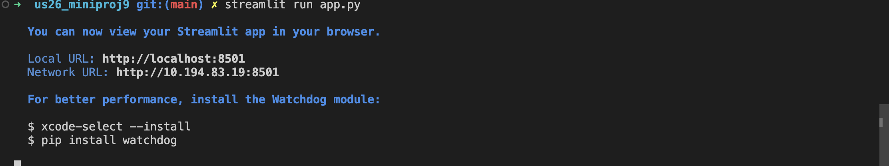
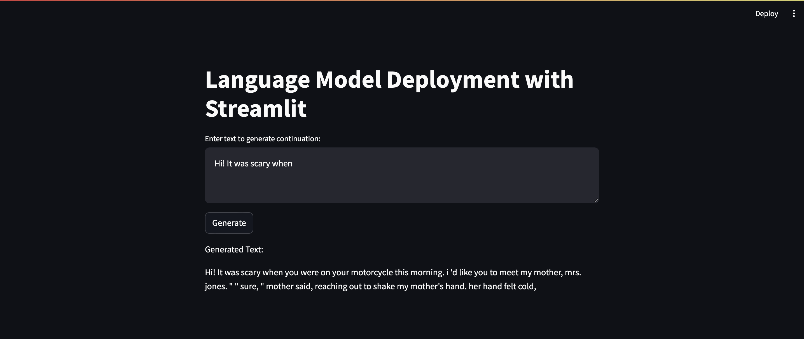

# us26_MiniProj9

URL to access the app - https://app-bveknc23yzqruvysv92ing.streamlit.app  

### Working of the app





### Step 1: Install Necessary Libraries
First, make sure you have Python and pip installed. Then install Streamlit and the Transformers library from Hugging Face:

```bash
pip install streamlit transformers
```

### Step 2: Create the Streamlit Web Application
Create a Python script `app.py` with the following code:

```python
import streamlit as st
from transformers import pipeline

# Load the language model
model = pipeline("text-generation", model="openai-gpt")

# Define Streamlit app
def main():
    st.title("Language Model Deployment with Streamlit")
    text_input = st.text_area("Enter text to generate continuation:")
    
    if st.button("Generate"):
        if text_input:
            generated_text = model(text_input, max_length=50, do_sample=True)[0]['generated_text']
            st.write("Generated Text:")
            st.write(generated_text)
        else:
            st.warning("Please enter some text first.")

if __name__ == "__main__":
    main()
```

### Step 3: Run Locally
Save the `app.py` file and run it locally using the following command:

```bash
streamlit run app.py
```

### Step 4: Deployment
You can deploy the Streamlit app using various services such as Heroku, Streamlit Sharing, AWS, or Azure. Here's a brief overview of deploying to Streamlit Sharing:

1. **Install Streamlit Sharing CLI**: If you haven't installed it yet, run:
   ```bash
   pip install streamlit
   ```
   
2. **Create a `requirements.txt` file**: You need to create a `requirements.txt` file that lists the dependencies of your app. You can generate this file using `pip freeze`:
   ```bash
   pip freeze > requirements.txt
   ```

3. **Create a `setup.sh` file**: Streamlit requires a `setup.sh` file to tell it how to run your app. Create a file named `setup.sh` with the following content:
   ```bash
   mkdir -p ~/.streamlit/
   echo "\
   [server]\n\
   headless = true\n\
   port = $PORT\n\
   enableCORS = false\n\
   \n\
   " > ~/.streamlit/config.toml
   ```

4. **Deploy using Streamlit Sharing CLI**: Navigate to your project directory in the terminal and run the following commands:
   ```bash
   streamlit login
   streamlit deploy your-email@example.com
   ```
   Replace `your-email@example.com` with your Streamlit Sharing account email.

### Step 5: Accessing the Deployed App
Once deployed, you'll receive a URL where your Streamlit app is accessible via a web browser.

This setup will allow users to input text, which will then be passed to the language model for text generation. The generated text will be displayed back to the user on the website.